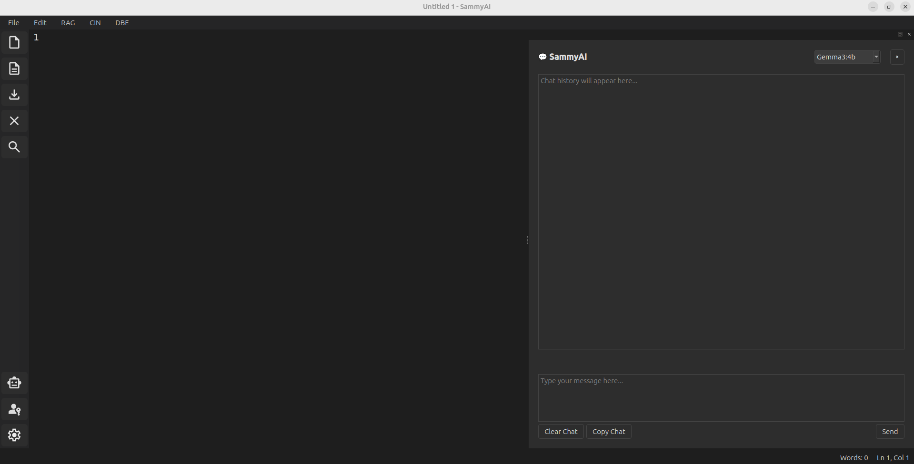

<div align="left">
  
  
  
</div>

<div align="center">


# SammyAI

**SammyAI is a creative writing assistant that helps writers brainstorm, draft, and refine stories of all genres and types.**

[Official Website](https://sammycwa.com)

---

[**About**](https://github.com/sasadjukic/sammyai/blob/main/documentation/1_WHAT_IS_SAMMYAI/1_What_is_SammyAI.md) &nbsp; | &nbsp; [**User Guide**](https://github.com/sasadjukic/sammyai/blob/main/documentation/3_USER_GUIDE/1_Layout.md) &nbsp; | &nbsp; [**Stories**](https://github.com/sasadjukic/sammyai/blob/main/documentation/6_STORIES/1_Stories_Introduction.md) &nbsp; | &nbsp; [**Best Practices**](https://github.com/sasadjukic/sammyai/blob/main/documentation/5_BEST_PRACTICES/1_Best_Practices_Overview.md)

---

## Free, open source, private, multi-model, local creative assistant for stories, screenplays, TV/Streaming Series, video games and more



</div>

## ✨ Key Features

- **Multi-modal Chat**: Seamlessly switch between different AI models during a single session to tailor assistance to your specific needs.
- **Context Injection (CIN)**: Directly inject specific reference files into the current AI conversation for informed brainstorming.
- **Retrieval-Augmented Generation (RAG)**: Index your project files to provide the AI with a deep "memory" of your world and characters.
- **Diff-Based Editing (DBE)**: Review AI suggestions via visual diffs and surgically apply changes to your drafts.

## 🚀 Getting Started

### Prerequisites
- Python 3.10+
- [Ollama](https://ollama.com/) (for local model support)

### Quick Install
1. **Clone the repository:**
   ```bash
   git clone https://github.com/sasadjukic/sammyai.git
   cd sammyai
   ```
2. **Install dependencies:**
   ```bash
   pip install -r requirements.txt
   ```
3. **Run SammyAI:**
   ```bash
   python text_editor.py
   ```

For detailed installation options including Docker support, see the [Installation Guide](https://github.com/sasadjukic/sammyai/blob/main/documentation/2_INSTALLATION/1_Start.md).

## 📖 Unleash Your Creativity

SammyAI is more than just a text editor; it's a collaborative partner for:
- **Essays & Short Stories**: From flash fiction to complex narratives.
- **Screenplays & Scripts**: Tailored for TV, movies, and streaming series.
- **Game Development**: Fast-track your world-building and dialogue creation.

Check out our [Story Archive](https://github.com/sasadjukic/sammyai/blob/main/documentation/6_STORIES/1_Stories_Introduction.md) to see examples of what SammyAI can help you create.

## 🔒 Privacy & Copyrights

- **100% Free**: Leverage local models and free cloud tiers.
- **Privacy First**: SammyAI does not collect or store your data. Everything runs locally on your PC.
- **Your Rights**: You retain full ownership and copyright of everything you create.

Read more in our [Cost, Privacy and Copyrights document](https://github.com/sasadjukic/sammyai/blob/main/documentation/1_WHAT_IS_SAMMYAI/2_Cost_Privacy_and_Copyrights.md).

## 🗺️ Roadmap

We are constantly evolving! Planned updates include:
- **Long-Form Stress Testing**: Ensuring stability for full-length novels.
- **Expanded File Support**: `.docx` and `.odt` compatibility.
- **Custom LLM Integration**: Bringing your own models into the workflow.

See [Planned Updates](https://github.com/sasadjukic/sammyai/blob/main/documentation/7_NEXT_STEPS/1_Planned_Updates.md) for more details.

## ⚖️ License

This project is licensed under the MIT License.

---

<div align="center">
Built with ❤️ by the SammyAI Team
</div>
