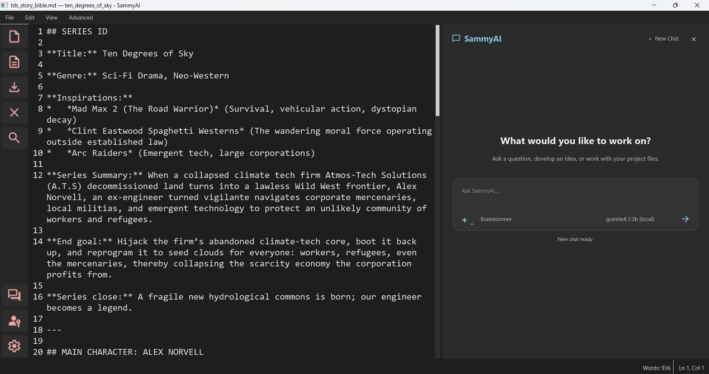
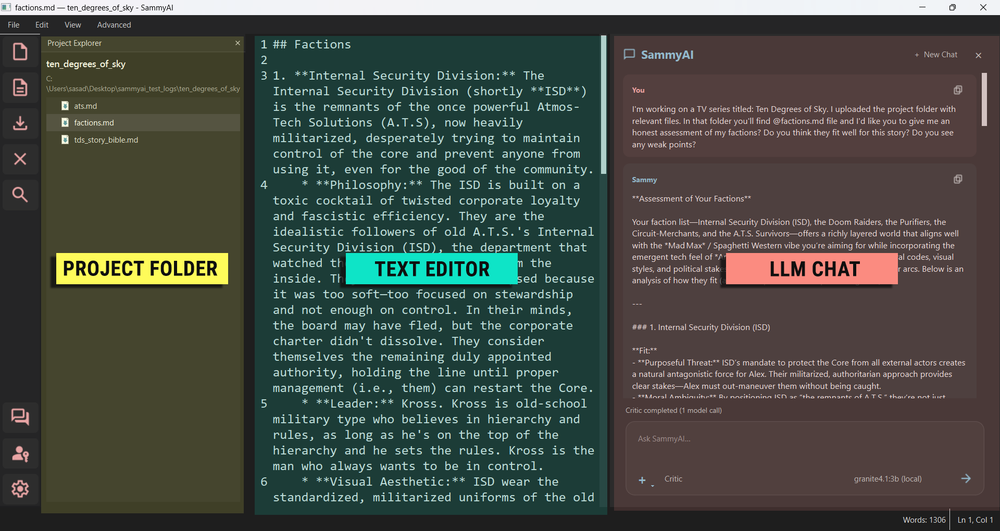

<div align="left">
  
  
  
  
</div>

<div align="center">


# SammyAI

**SammyAI is a creative writing assistant that helps writers brainstorm, draft, and refine stories of all genres.**

[Official Website](https://sammycwa.com)

---

[**About**](https://github.com/sasadjukic/sammyai/blob/main/documentation/1_WHAT_IS_SAMMYAI/1_What_is_SammyAI.md) &nbsp; | &nbsp; [**User Guide**](https://github.com/sasadjukic/sammyai/blob/main/documentation/3_USER_GUIDE/1_Layout.md) &nbsp; | &nbsp; [**Stories**](https://github.com/sasadjukic/sammyai/blob/main/documentation/6_STORIES/1_Stories_Introduction.md) &nbsp; | &nbsp; [**Best Practices**](https://github.com/sasadjukic/sammyai/blob/main/documentation/5_BEST_PRACTICES/1_Best_Practices_Overview.md)

---



---




</div>

## Key Features

- **Agent Workflows**: SammyAI supports multiple writing agents: Assistant, Brainstormer, Writer, Editor, and Critic. 
- **Set up Your Own LLM's**: Install and run your own LLM's locally using Ollama or choose your favorite cloud LLM provider and their latest releases.
- **Change LLM Settings**: Change LLM settings such as temperature, top-p and seed to tailor assistance to your specific needs.
- **Multi-model Chat**: Seamlessly switch between different AI models during a single session to tailor assistance to your specific needs.
- **Writing Projects**: Open a folder as a persistent project and browse its files from a live, collapsible explorer.
- **Context Injection (CIN)**: Directly inject specific reference files into the current AI conversation for informed brainstorming.
- **Retrieval-Augmented Generation (RAG)**: Index your project files to provide the AI with a deep "memory" of your world and characters.
- **Diff-Based Editing (DBE)**: Review AI suggestions via visual diffs and surgically apply changes to your drafts.

Check out all the features [Features](https://github.com/sasadjukic/sammyai/blob/main/documentation/1_WHAT_IS_SAMMYAI/3_Features.md).

## Getting Started

### Prerequisites
- Python 3.11–3.14
- [Ollama](https://ollama.com/) (for local model support)

### Quick Install
1. **Clone the repository:**
   ```bash
   git clone https://github.com/sasadjukic/sammyai.git
   cd sammyai
   ```
2. **Install dependencies:**
   ```bash
   python -m pip install -e .
   ```
3. **Run SammyAI:**
   ```bash
   sammyai
   ```

For detailed installation options including Docker support, see the [Installation Guide](https://github.com/sasadjukic/sammyai/blob/main/documentation/2_INSTALLATION/1_Start.md).

## Stories

SammyAI is a valuable collaborative partner for:
- **Essays & Short Stories**: From flash fiction to complex narratives.
- **Novels & Epics**: Build rich fictional worlds of all genres.
- **Screenplays & TV Pilots**: Tailored for movies and TV/streaming series.
- **Game Development**: Fast-track your world-building and dialogue creation.

Check out our [Story Archive](https://github.com/sasadjukic/sammyai/blob/main/documentation/6_STORIES/1_Stories_Introduction.md) to see examples of what SammyAI can help you create.

## Privacy & Copyrights

- **100% Free**: Leverage local models and free cloud tiers.
- **Privacy First**: SammyAI does not collect or store your data. Everything runs locally on your PC.
- **Your Rights**: You retain full ownership and copyright of everything you create.

Read more in our [Cost, Privacy and Copyrights document](https://github.com/sasadjukic/sammyai/blob/main/documentation/1_WHAT_IS_SAMMYAI/2_Cost_Privacy_and_Copyrights.md).

## Roadmap

Planned updates include:
- **Long-Form Stress Testing**: Ensuring stability and output quality.
- **Agent Workflow Quality**: Improve draft, evaluation, and revision behavior.
- **Writing Styles:** Implementing custom writing styles

See [Planned Updates](https://github.com/sasadjukic/sammyai/blob/main/documentation/7_NEXT_STEPS/1_Planned_Updates.md) for more details.

## License

This project is licensed under the MIT License.

