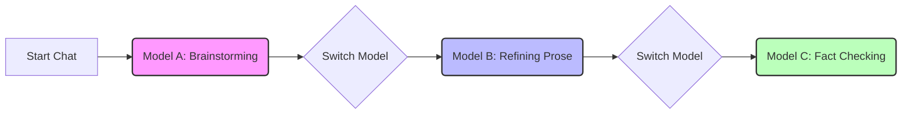

# ✨ SammyAI Features

To elevate your creative endeavors, SammyAI offers a suite of powerful features designed to help you create with better context, precision, and control. Understanding when and how to use these tools will ensure you get the absolute most out of your creative experience.

---

## 💉 Context Injection (CIN)

*Context Injection* allows you to provide extra information—such as world-building documents, character notes, or specific snippets—that the model uses to ground its outputs. Think of it as providing "background reading" for the AI.

*   **How it works**: Injected context is treated as part of the prompt, helping guide tone, facts, and style.
*   **Best for**: Story bibles, character sheets, and style guides. It's simple, precise, and gives the LLM the "full picture" instantly.

> [!IMPORTANT]
> **Mind the Context Window**
> When using Context Injection, you must be aware of the LLM's context window limits. Massive files might exceed these limits, leading to lost information or errors.

*You can manage this via the **CIN** tab in the main menu.*

---

## 📚 RAG (Retrieval-Augmented Generation)

*RAG* retrieves only the most relevant sections from your documents and supplies them to the model at the exact moment they are needed. This allows you to reference massive amounts of data without overwhelming the AI.

*   **How it works**: Your documents are "indexed." When you ask a question, SammyAI looks for the most relevant "chunks" of text to ground the answer.
*   **Best for**: Deep research, long-running series, or referencing specific facts across hundreds of pages.

> [!CAUTION]
> **Resource Usage**
> RAG can be resource-intensive, particularly for your system's RAM. It is highly recommended for longer works like novels or series, but may be overkill for short stories or essays.

*Current limit: Up to 50MB files. Manage via the **RAG** tab.*

---

## ⚖️ Context Injection vs. RAG 

Choosing the right approach depends on the scale of your project:

| Feature | Approach | Ideal For | Accuracy |
| :--- | :--- | :--- | :--- |
| **Context Injection** | "Brute Force" / Long Context | Story Bibles, short guides (~1-2 pages) | Perfect |
| **RAG** | "Library" / Vector Search | 200+ page books, massive lore files | High (Contextual) |

---

## 🛠️ Diff-Edits (DBE)

*Diff-Edits* (Difference-Based Edits) enable surgical precision in your writing. Rather than rewriting an entire chapter, you can apply targeted changes and review exactly what moved where.

*   **Precision Editing**: Perfect for tasks like *"enhance the dialogue on line 34"* or *"add tension to the second paragraph."*
*   **Approval Workflow**: SammyAI shows you a "diff"—your original text vs. the suggested rewrite. You decide what stays and what goes.

> [!TIP]
> **Timing is Everything**
> Enable **DBE** during the "polishing" phase. Keeping it on during initial brainstorming or draft-writing may slow your creative flow.

*Access via the **DBE** tab in the menu bar.*

---

## 🎭 Multi-Modal Chat

SammyAI breaks the "brand barrier" by allowing you to interact with multiple Large Language Models (LLMs) from different providers within a single, dynamic session.

### How it Works
1.  **Select**: Use the dropdown to pick your model (Local or Cloud).
2.  **Chat**: SammyAI generates responses using that specific model.
3.  **Switch**: Switch models mid-conversation whenever you like.
4.  **Continuity**: Every model shares the **entire** conversation history.

### Key Benefits
*   **Compare Strengths**: Pit a fast local model against a massive cloud model instantly.
*   **Task Optimization**: Use different models for different creative stages (e.g., brainstorming vs. refining).
*   **Zero Context Loss**: No need to re-explain yourself—the memory follows you across models.

---

## ⚡ Quick Reference: When to use what?

| Your Goal | Recommended Tool |
| :--- | :--- |
| **Initial Brainstorming** | Multi-Modal Chat (Cloud Models) |
| **Reference Story Lore** | Context Injection (CIN) |
| **Reference Massive Series Data** | RAG |
| **Fine-tuning Dialogue/Prose** | Diff-Edits (DBE) |
| **Local Privacy/Quick Drafting** | Multi-Modal Chat (Local Models) |

