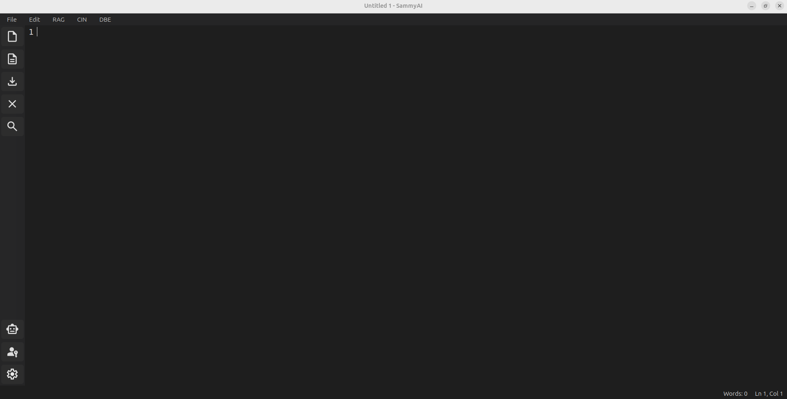

# SammyAI Workspace Layout

SammyAI features a professional, distraction-free environment designed for high-performance writing and AI-assisted creation. The interface is divided into four primary logical areas.

---

## 1. Sidebar Toolbar (Left)
The vertical Sidebar Toolbar provides instant access to core file operations and system-level configurations.

*   **File Operations**: Quick access to **New**, **Open**, **Save**, and **Close**.
*   **Search (Ctrl+F)**: Toggles the inline search and replace widget.
*   **AI Agent Context**: Toggle the chat interface for AI collaboration.
*   **System Settings**: Configure **API Keys** and **LLM Parameters** (Temperature, Top-P) to fine-tune your creative partner.

## 2. Top Menu Bar
The Menu Bar contains comprehensive command sets for advanced document and AI management.

*   **File & Edit**: Standard document handling and undo/redo/repeat actions.
*   **RAG (Retrieval-Augmented Generation)**: Index files to provide the AI with a deep "memory" of your project.
*   **CIN (Context Injection)**: Directly inject specific reference files into the current AI conversation.
*   **DBE (Diff-Based Editing)**: Toggle the specialized mode where the AI suggests changes via visual diffs for your approval.

## 3. Editing Canvas (Center)
The central workspace is a high-performance text editor optimized for clarity.

*   **Line Numbers**: Essential for reference and precise editing.
*   **Visual Diffing**: When in DBE mode, this area transforms to show side-by-side or inline comparisons of AI suggestions.
*   **Focus-First Design**: Minimalist aesthetics to keep your content as the primary focus.

## 4. Status Bar (Bottom)
The Status Bar provides real-time feedback on your document's state.

*   **Word Count**: Live tracking of your progress.
*   **Cursor Position**: Precise Line (Ln) and Column (Col) indicators.
*   **System Status**: Brief notifications regarding RAG indexing, LLM initialization, and background tasks.

---

> [!TIP]
> Use **Ctrl+Shift+Y** (Repeat) to quickly re-apply the last edit-related action, or **Ctrl+D** to compare your current draft with an external file.
