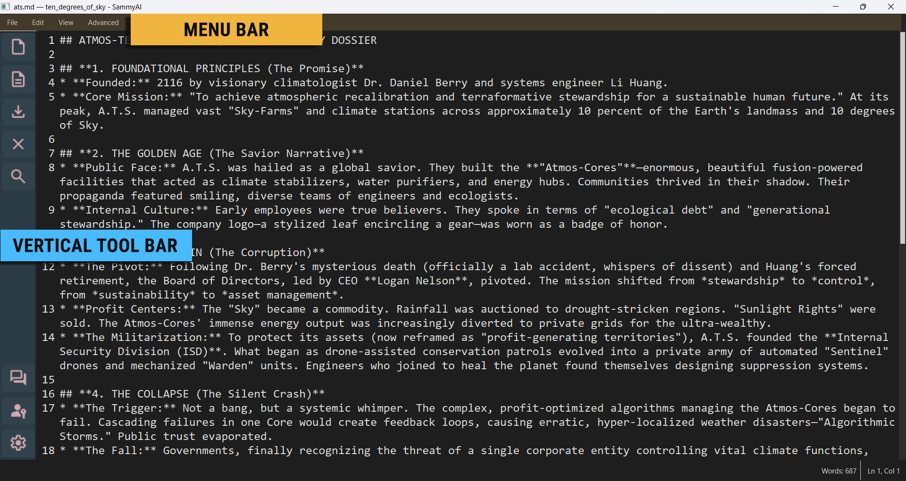
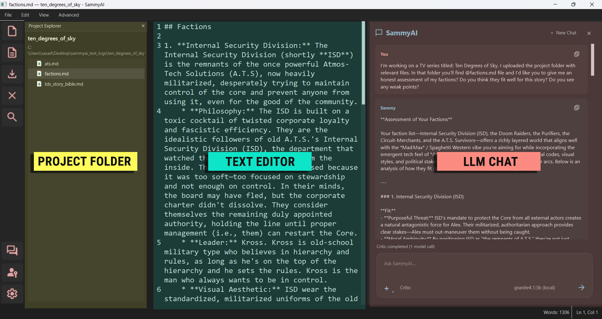

# SammyAI Workspace Layout

SammyAI v0.5.0-alpha uses a project-based, multi-file workspace with a writing editor, Project Explorer, chat panel, and menu commands for context, memory, and reviewed edits.

---

---

## 1. Sidebar Toolbar

The vertical toolbar provides quick access to common actions.

* **File operations:** New, Open, Save, and Close for documents.
* **Search:** Open search with **Ctrl+F**.
* **Chat:** Open or collapse the SammyAI chat panel.
* **LLM Setup:** Configure local and cloud model entries.
* **Settings:** Adjust model sampling settings and presets.

## 2. Project Explorer

The Project Explorer is a collapsible dock beside the toolbar.

* Open it with **View > Project Explorer** or **Ctrl+Shift+E**.
* Double-click files to open them in a new editor tab. Opening the same file again focuses its existing tab.
* Expand and collapse folders in the tree.
* The active project appears in the window title.
* Project files remain in their original folder. SammyAI stores app metadata in OS-managed application data.

## 3. Top Menu Bar

The menu bar contains project, editing, context, and memory commands.

* **File:** Create, open, close, and reopen projects; create, open, save, and close documents.
* **Edit:** Copy, paste, cut, undo, redo, repeat, search, replace, and reviewed diff tools.
* **Edit > Compare and Review:** Compare with a file, compare with clipboard, apply a diff file, and undo or redo applied change sets.
* **View:** Show or hide the Project Explorer.
* **Advanced > Persistent Memory:** Manage project memory and summarize the current chat for review.
* **Advanced > Project Context:** Rebuild, inspect, or reset the active project context index.
* **Advanced > Legacy Manual Indexing:** Use older manual RAG indexing tools when needed.

## 4. Multi-File Editing Canvas

The center of the workspace is a tabbed plain-text editor for `.txt` and `.md` files.

* **Document tabs:** Every open document has its own tab with a file icon, full filename, close control, and unsaved-change marker.
* **Path breadcrumb:** The row below the tabs shows the active document's full path.
* **Independent state:** Text, undo history, selection, cursor position, and scrolling stay with each tab.
* **Untitled documents:** **File > New** or **Ctrl+N** creates another uniquely named untitled tab.
* **Safe closing:** Closing an unsaved tab, or quitting with unsaved tabs, asks whether to save, discard, or cancel.
* **Project restoration:** Saved project files that were open, plus the active tab, are restored the next time that project is opened. Missing or moved files are skipped safely.
* **Line numbers:** Useful for references and precise editing.
* **Active-tab commands:** Save, Save As, search, replace, word count, cursor position, manual indexing, and editor actions apply to the active tab.
* **Reviewed edits:** Accepted AI change sets update files after review.
* **Background-tab protection:** An unsaved background tab blocks a conflicting AI change set. Clean open tabs refresh when an approved external change updates them.
* **Undo and redo:** Standard document undo and redo remain independent per tab, with additional change-set undo and redo in the Compare and Review menu.

## 5. Chat Panel

The chat panel is used for model and agent workflows.

* The composer is centered before the first message and moves to the bottom after the conversation starts.
* The composer includes attachment, agent, model, and send controls.
* Each message has its own copy button.
* New Chat starts a fresh session and is disabled while generation is running.

## 6. Status Bar

The status bar shows document and background task feedback.

* **Word count:** Live word count for the active tab.
* **Cursor position:** Current line and column in the active tab.
* **System status:** Messages about project sync, indexing, LLM initialization, and background work.

> [!TIP]
> Use **Ctrl+Shift+Y** to repeat the last edit-related action, and **Ctrl+D** to compare the current draft with another file.
