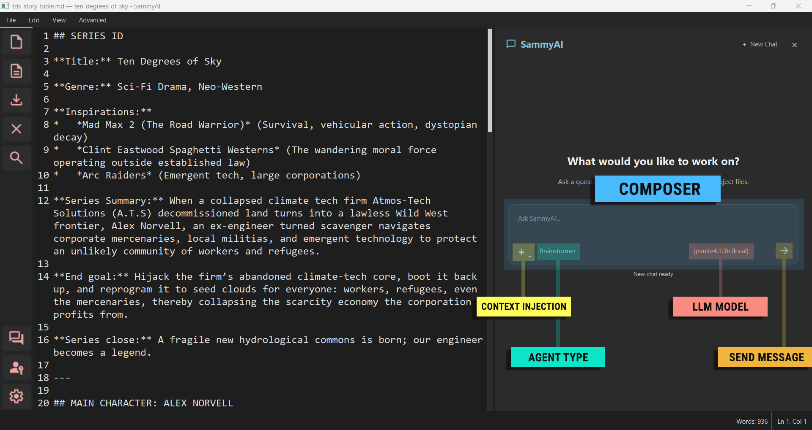

# SammyAI LLM Chat

The LLM Chat panel is the main interface for AI collaboration. It supports multiple agents, configurable models, temporary references, project context, and session-based conversations.

---

---

## 1. Header

The header shows the SammyAI chat title and session controls.

* **New Chat:** Starts a fresh chat session and clears the current session context. The previous session state is preserved by the session system.
* **Collapse chat panel:** Hides the panel without deleting the current chat.
* **Generation lock:** New Chat is disabled while SammyAI is generating a response.

## 2. Conversation Area

Messages are displayed as structured blocks.

* **You:** Your prompts.
* **Sammy:** Assistant responses.
* **SammyAI:** Status messages and workflow progress.
* **Copy per message:** Each user and assistant message can be copied individually.

## 3. Composer

The composer holds the prompt field and workflow controls.

* **Input field:** Auto-grows as you type.
* **Send:** Press **Enter** to send.
* **New line:** Press **Shift+Enter** to insert a line break.
* **Attachment button:** Attach a temporary external reference to the conversation.
* **Agent selector:** Choose Assistant, Brainstormer, Writer, Editor, or Critic.
* **Model selector:** Choose one of your configured models.

## 4. Agents

Agents change how SammyAI handles the next message.

* **Assistant:** General conversation and read-only help.
* **Brainstormer:** Idea generation and creative exploration.
* **Writer:** Drafting workflow with evaluation and revision behavior.
* **Editor:** File-change proposals through reviewed change sets.
* **Critic:** Read-only critique and feedback.

Existing files require complete explicit file context before the Editor can modify them. If a filename is ambiguous, reference it by relative path.

## 5. Project Context

When a project is open, SammyAI can build context from:

* Explicit file references.
* Attached temporary references.
* Project retrieval.
* Approved persistent memory.
* Approved conversation summaries.

These sources share a bounded context budget, so smaller and more precise references usually produce better results.

## 6. Session Notes

Collapsing the chat panel does not end the current session. Use **New Chat** when you want a fresh conversation context.

> [!TIP]
> For file edits, first reference the exact file, then ask the Editor agent for a specific change. Review the proposed change set before applying it.
