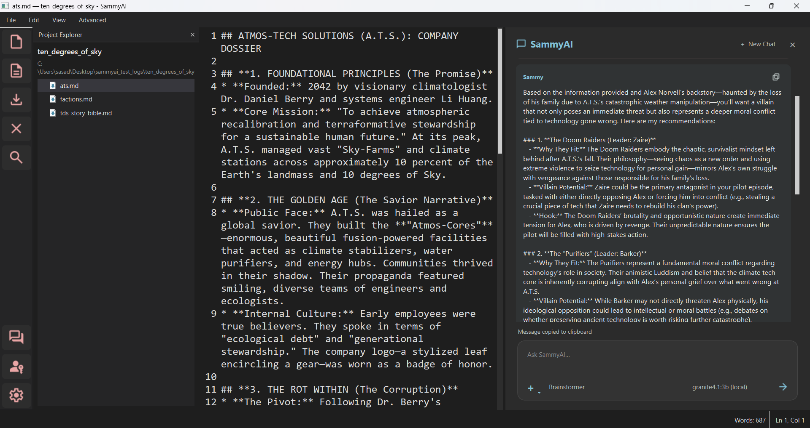

# SammyAI LLM Chat

The LLM Chat panel is your primary interface for interacting with SammyAI. It provides a powerful, expandable environment for brainstorming, refining text, and exploring ideas with AI models.

---

## 1. Header & Model Selection
At the top of the chat panel, you'll find the session header and the **Model Selector**.

*   **Model Selector**: Choose between local models (like Gemma 3:4B) for privacy and speed, or advanced cloud models (like Gemini 2.5 Flash) for complex creative tasks. Switching models updates the current session context immediately.
*   **Expansion & Closure**: The panel can be expanded for more reading space or closed via the **✕** button to return to a full-screen editing canvas.

## 2. Chat History
The history area displays your dialogue with Sammy in a structured, color-coded format.

*   **You (Light Pink)**: Your messages are highlighted for clear visibility.
*   **Sammy (Light Blue)**: The AI's responses appear with distinct branding to differentiate them from project notes or status messages.
*   **Status Indicators**: Brief messages (in italics) appear when the session is reset or when Sammy is "thinking."

## 3. Interactive Input Field
The multi-line input field at the bottom is optimized for detailed prompts.

*   **Smart Entry**: Press **Ctrl+Enter** to send your message instantly. Standard **Enter** creates a new line, allowing you to compose structured prompts without accidental submission.
*   **Auto-Scroll**: The interface automatically scrolls to the newest response, keeping your attention on the evolving conversation.

## 4. Session Controls
Located just below the input field, these buttons allow you to manage your session data effectively.

*   **Delete Chat**: Purges the visible history and resets the cumulative LLM context, starting a fresh session.
*   **Copy Chat**: Copies the entire conversation history to your clipboard—perfect for archiving brainstorms or pasting ideas into your main document.

## 5. Context Controls
*   **RAG (Retrieval-Augmented Generation)**: Index files to provide the AI with a deep "memory" of your project.
*   **CIN (Context Injection)**: Directly inject specific reference files into the current AI conversation.
*   **DBE (Diff-Based Editing)**: Toggle the specialized mode where the AI suggests changes via visual diffs for your approval.

---

> [!NOTE]
> SammyAI chat window collapses and expands. DO NOT confuse collapse with ending chat. The current chat session ends only when you press **Delete Chat** button, or when you exit the application. Everything else just collapses the chat window, and the current chat remains active.
