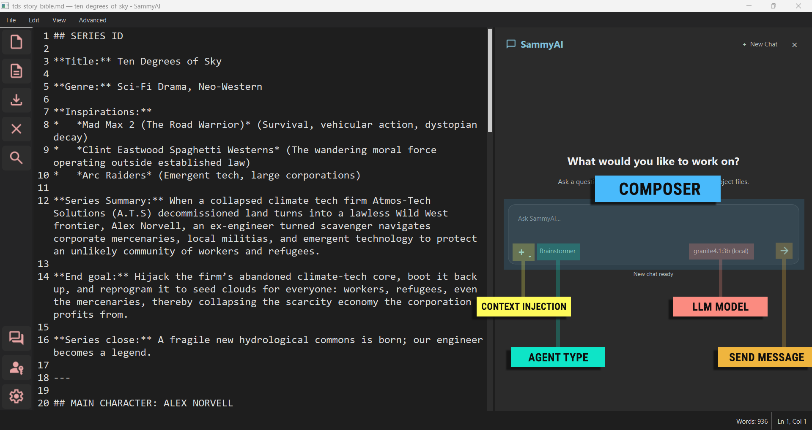
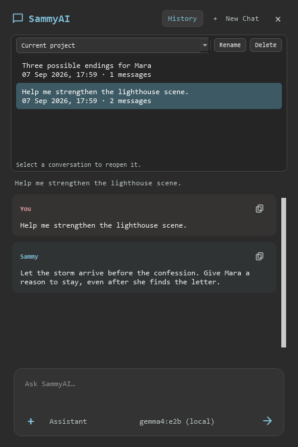

# SammyAI LLM Chat

The LLM Chat panel is the main interface for AI collaboration. It supports multiple agents, configurable models, temporary references, project context, and session-based conversations.

---

---

## 1. Header

The header shows the SammyAI chat title and session controls.

* **New Chat:** Starts a fresh chat session and clears the current session context. The previous session state is preserved by the session system.
* **Collapse chat panel:** Hides the panel without deleting the current chat.
* **History:** Expands a compact list above the conversation, keeping the composer available.
* **Generation lock:** Sending, New Chat, agent selection, and history changes are disabled while SammyAI is generating a response.

## 2. Conversation Area

Messages are displayed as structured blocks.

* **You:** Your prompts.
* **Sammy:** Assistant responses.
* **SammyAI:** Status messages and workflow progress.
* **Copy per message:** Each user and assistant message can be copied individually.

## 3. Composer

The composer holds the prompt field and workflow controls.

* **Input field:** Auto-grows as you type.
* **Send:** Press **Enter** to send.
* **New line:** Press **Shift+Enter** to insert a line break.
* **Attachment button:** Attach a temporary external reference to the conversation.
* **Agent selector:** Choose Assistant, Brainstormer, Writer, Editor, or Critic.
* **Model selector:** Choose one of your configured models.

## 4. Agents

Agents change how SammyAI handles the next message.

* **Assistant:** General conversation and read-only help.
* **Brainstormer:** Idea generation and creative exploration.
* **Writer:** Drafting workflow with evaluation and revision behavior.
* **Editor:** File-change proposals through reviewed change sets.
* **Critic:** Read-only critique and feedback.

Existing files require complete explicit file context before the Editor can modify them. If a filename is ambiguous, reference it by relative path.

## 5. Project Context

When a project is open, SammyAI can build context from:

* Explicit file references.
* Attached temporary references.
* Project retrieval.
* Approved persistent memory.
* Approved conversation summaries.

These sources share a bounded context budget, so smaller and more precise references usually produce better results.

## 6. Chat History

Click **History** to browse saved conversations. Each row shows a title, the last
update time, and the message count. Hover over a row for a preview; select it to
restore its transcript. The current title stays visible above the transcript.

With a project open, the list defaults to **Current project**. Choose **All
conversations** to browse everything, or **Unassigned** to find older chats that
have no project metadata. Selecting a conversation does not open or change its
project; the currently open project still supplies context for new requests.

Titles come from the first user message, without an AI call. Use **Rename** for a
custom title. **Delete** asks for confirmation and permanently removes that
conversation and its messages. **New Chat** preserves the previous conversation.

SammyAI remembers the last selected conversation across restarts. If it is no
longer available, the most recently updated valid conversation is restored.
Unsent drafts are preserved when switching during the current app session, but
are not saved across restarts. Hover over a restored message to inspect its
timestamp and saved agent metadata.

While a response is running, you can browse the list but cannot switch, rename,
delete, or start another conversation. These controls become available when the
response completes or fails. This also applies to legacy DBE requests.

If a saved file cannot be read, the history list shows a notice and continues
loading other conversations. Unreadable files are preserved. Removing a project
retains the existing cleanup behavior: only conversations and messages known to
belong to that project are removed.

## 7. Session Notes

Collapsing the chat panel does not end the current session. Use **New Chat** when you want a fresh conversation context.

> [!TIP]
> For file edits, first reference the exact file, then ask the Editor agent for a specific change. Review the proposed change set before applying it.
