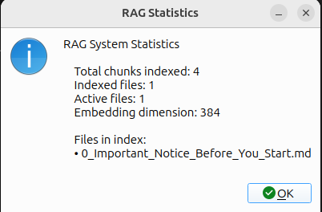

# RAG Menu Options

Retrieval-Augmented Generation (RAG) is the "long-term memory" of SammyAI. By indexing your documents, you allow the AI to reference specific details, lore, and project history across your entire workspace, ensuring consistent and context-aware creative assistance.

---

## 1. Index Current File for RAG
This option tells SammyAI to actively "read" and store the contents of your current document into its knowledge base.

*   **Keyboard Shortcut**: `Ctrl+Shift+I`
*   **Intelligent Indexing**: SammyAI breaks your text into small "chunks" and generates mathematical embeddings. This allows the AI to retrieve only the most relevant sections during a conversation, maintaining high performance even with large projects.
*   **Size Safety**: To ensure a smooth experience, SammyAI will prompt for confirmation before indexing files larger than **500KB**.
*   **Feedback**: Monitor the **Status Bar** (bottom) for a live index tracker:
    *   `Indexing [Filename]...`: Process in progress.
    *   `✓ Indexed [Filename]`: Successfully added to memory.

## 2. Clear RAG Index
Use this command to wipe the AI's project memory completely.

*   **When to Use**: Essential when switching to a completely different project or if you wish to "clean the slate" after significant structural changes to your documents.
*   **Safety First**: This action requires a confirmation click to prevent accidental data removal from the RAG system.

## 3. Show RAG Statistics
This provides a high-level overview of everything SammyAI currently "knows" about your project.

*   **Total Chunks**: The total number of text fragments stored in the index.
*   **Indexed Files**: A list of all files that have been successfully processed.
*   **Active Files**: Files that are currently being prioritized for context during chat sessions.

---

> [!IMPORTANT]
> The RAG system is persistent. Once a file is indexed, it remains in SammyAI's memory even after you close the application, until you manually clear the index from the application. You can also manually delete files from *cache* folder to remove any indexed files.
