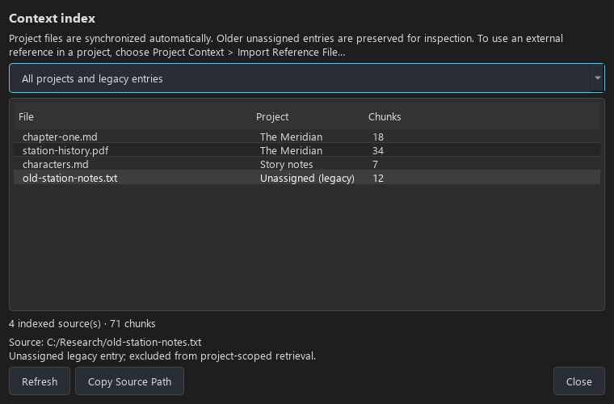

# Project Context and RAG Options

Retrieval-Augmented Generation (RAG) helps SammyAI find relevant details from project files without pasting entire documents into the prompt. Project context is synchronized automatically for supported files; there is no separate manual indexing step.

---

## 1. Automatic Project Synchronization

When a project is open, SammyAI tracks supported files and updates project context in the background.

* **Supported formats:** `.md`, `.txt`, and `.pdf`.
* **Change detection:** Files are tracked with content hashes.
* **Project isolation:** Retrieval is scoped to the active project.
* **Sync timing:** Synchronization can run when a project opens or when files are saved.
* **Deleted files:** Removed files are cleaned from the project manifest and retrieval state.

## 2. Advanced > Project Context

Use this menu to add persistent references, inspect indexed files, and maintain context.

* **Import Reference File:** Copy an external `.md`, `.txt`, or `.pdf` file into the active project's `References` folder and schedule automatic synchronization.
* **Indexed Files:** Inspect source paths, project attribution, and chunk counts without changing the index.
* **Rebuild Active Project Index:** Reprocess supported files in the active project.
* **Context Index Statistics:** Show high-level information about the current context index.
* **Reset Entire Context Index:** Clear the complete local index after confirmation. The active project rebuilds automatically; other projects rebuild when reopened. Unassigned legacy entries cannot be restored automatically. Original files are not deleted.

Use **Rebuild Active Project Index** if retrieval seems stale. Reserve the global reset for recovery that requires clearing the entire index.

## 3. Importing Persistent References

Open a project, then choose **Advanced > Project Context > Import Reference File...** and select a supported file. The imported copy appears in the project's `References` folder and participates in normal project context synchronization.

* The original file is preserved. Later edits to it do not update the project copy.
* Existing files and open document paths are never overwritten. Repeated names receive a numeric suffix, such as `research 2.pdf`.
* Selecting a file already inside the project uses that file without duplicating it. Files in folders excluded from project context cannot be imported in place.
* Edit or remove the project copy to change its contribution to project context. A rebuild can pick up changes made outside SammyAI immediately.
* Imports require an open project. Temporary chat attachments and explicit file references remain available for context needed only in a conversation.

The retired **Legacy Manual Indexing** menu is no longer needed. Existing index entries are preserved; no automatic deletion or reassignment takes place.

## 4. Inspecting Indexed Files

Choose **Advanced > Project Context > Indexed Files...**. Filter by the active project, all projects and legacy entries, or unassigned legacy entries. Select a row to see its source path and project ID; use **Copy Source Path** or **Refresh** as needed.

Unassigned legacy entries have no project attribution and are excluded from project-scoped retrieval. To use an old external reference in a project, locate its source with this inspector and import that file into the project. The inspector remains available without an open project when the context index is initialized.

## 5. Explicit File Context

Use explicit file references when SammyAI must rely on a specific file.

* Reference the exact file before asking for edits.
* Use relative paths when two files share the same name.
* Appending or inserting new material requires explicit file context with the ending or a unique target line. The entire file need not fit.
* Whole-file replacement and deletion require complete explicit file context.

## 6. Context Budget

Explicit file context, attached references, persistent memory, and retrieved RAG chunks share the same bounded prompt budget. If a response misses important context, narrow the prompt, reference fewer files, or summarize older material into persistent memory.

Large text files use a partial view containing the ending, relevant excerpts, and
headings. SammyAI keeps an exact local snapshot for conflict checks and preserves
the omitted text when applying an addition. Partial context is identified in chat;
it does not authorize a whole-file rewrite.

The default file/context allowance is 4,000 estimated tokens. Append and insertion
requests have a separate 4,000 estimated-token allowance for **new material across
the proposal**, independent of existing file length. Both are service policies that
can be tuned separately as model support evolves. These estimates do not describe
the model's total context window or include all conversation/workflow messages.

> [!IMPORTANT]
> RAG is persistent across sessions, but it is project-scoped. Switching projects changes the retrieval namespace.
