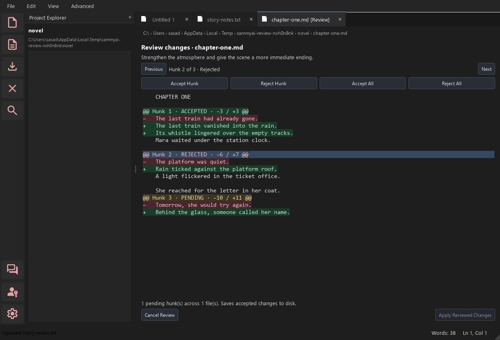

# Inline Diff Review

SammyAI v0.6.0-alpha shows proposed edits inside the affected document tabs.
Your draft stays intact until you finish reviewing and explicitly apply your decisions.



## Review a proposal

1. Open a project, select the Editor agent, reference the exact file, and request an edit.
2. Each affected document opens in a tab marked **[Review]**. The read-only review
   shows unchanged context, removed lines prefixed with **−**, and proposed lines
   prefixed with **+**. Each hunk is labeled **PENDING**, **ACCEPTED**, or **REJECTED**.
3. Select a hunk by clicking its text or using **Previous** and **Next**. Choose
   **Accept Hunk** or **Reject Hunk**. You can change your decision before applying.
4. **Accept All** and **Reject All** affect the current file. For a proposal covering
   several files, visit each review tab. The footer counts unresolved hunks across
   the entire proposal.
5. When all hunks have a decision, choose **Apply Reviewed Changes**. All accepted
   project changes are saved together. Rejecting every hunk leaves the files unchanged.

Creating or deleting a file is one indivisible decision, including empty files.
Updating an existing file supports partial acceptance. The final text is rebuilt
from the original snapshot, so earlier line insertions cannot move later edits.
Long, highly repetitive passages may be grouped into a larger hunk to keep review
generation responsive; accepting or rejecting it still preserves the exact snapshot.

**Cancel Review** discards the proposal's decisions in all its tabs and resumes
normal editing. It does not modify your draft or files. Newly proposed files do
not exist on disk until applied; their temporary tabs close when canceled or rejected.

## Additions to large files

Ask Brainstormer, Writer, or Editor to append or insert material using an explicit
file reference. A request such as `Add Scene 20 to @scene_breakdown.md` can produce
a small addition even when the full breakdown exceeds the file-context allowance.
For insertion between scenes, name the next scene heading: `Insert an interlude
before Scene 10 in @scene_breakdown.md`.

The model supplies only the new text. SammyAI finds the insertion point in its
captured source, keeps the existing content intact, and opens the normal inline
review. An insertion anchor must be a unique complete source line included in the
supplied context. “After” an anchor means after that line; to insert after a whole
scene, target the next scene's heading or append at the end of the file.

Request a new proposal if the source changes while the agent is working or while
review is open. SammyAI does not silently move an addition to a changed file.
Existing section headings and numbered scenes are checked for obvious duplicates
within the same parent section;
review remains necessary to catch narrative or semantic duplication.

This release supports additions to large files. Replacing a selected section of
an oversized file is not yet supported by the agent contract.

## Drafts, conflicts, and undo

- Structured project proposals require clean buffers for every affected file,
  including background tabs. Save or discard existing edits before requesting a proposal.
- While reviewing, the original editor is locked. Finish or cancel before saving,
  replacing text, renaming, or deleting the file. Find and Copy work in the review surface.
- File hashes, document identities, and buffer revisions are checked before apply.
  If anything changed, the proposal stays open with a conflict message. Cancel it,
  reopen the current file if needed, and request a new proposal.
- Project files use path confinement, staged atomic writes, backups, rollback on
  failure, and **Edit > Compare and Review > Undo Last Applied Change Set / Redo
  Last Applied Change Set**. History operations also protect dirty or reviewed tabs.
- Untitled drafts, unsaved buffers, and files outside the active project use
  **Apply to Draft**. This is one normal editor **Undo / Redo** step; use **Save**
  afterward. If a draft has a path, an external disk change also blocks its review.
- Closing a reviewed tab or exiting asks whether to cancel its pending proposal.
  Project switches ask to cancel pending reviews. Review decisions are temporary
  and are not restored after restart; unapplied proposals never alter source files.

## Manual comparisons

**Edit > Compare and Review** also provides:

- **Compare with File… (Ctrl+D)**: propose the selected file's text for the current document.
- **Compare with Clipboard (Ctrl+Shift+D)**: review clipboard text against the current document.
- **Apply Diff from File…**: validate a `.diff` or `.patch` and review the resulting changes.

These tools use the same inline controls. For a clean file inside the active project,
Apply saves through the project file tools. For a draft, the footer says **Apply to Draft**.

Legacy DBE mode has been retired. To request an AI edit, save the document in the
active project, select the **Editor** agent, and reference the file explicitly,
for example `Tighten the dialogue in @chapter.md`. Review the resulting proposal
before applying it. Selecting text alone does not start an AI edit or supply
editable context. Existing documents and conversation history are preserved.

The previous popup remains a temporary compatibility fallback during Windows
acceptance. To enable it for one PowerShell session before launching:

```powershell
$env:SAMMYAI_POPUP_REVIEW = '1'
.\Scripts\python.exe sammyai.py
```

Remove that environment variable to return to inline review. The fallback reviews
whole proposals and retains the old popup's controls.
