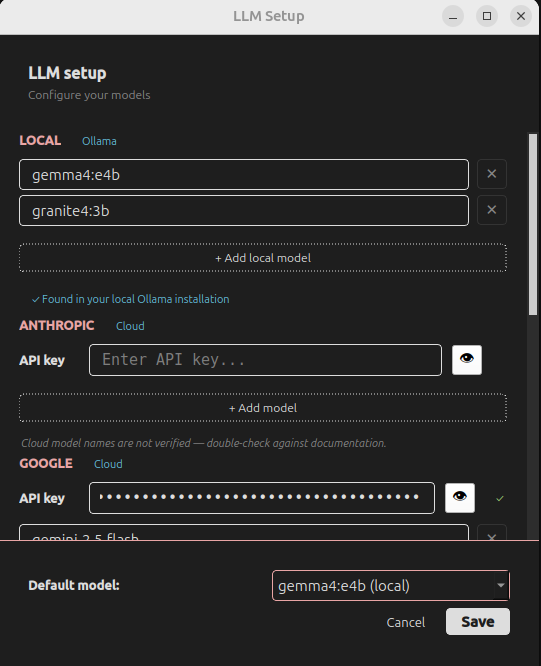

# ⚙️ LLM Setup & Configuration

In Alpha 0.3.1, SammyAI has transitioned from a fixed model list to a **Dynamic LLM Setup**. This allows you to build a custom library of AI models tailored to your specific writing needs.

---

## 1. Dynamic Model Management

The new **LLM Setup Panel** (formerly API Key Configuration) gives you full control over which models are available in your chat interface.

*   **15 Total Slots**: You can configure and save up to 15 different models simultaneously.
*   **Provider Diversity**:
    *   **Local (Ollama)**: Connect up to 3 local models running on your own hardware.
    *   **Cloud Providers**: Add up to 3 models each for **Google**, **OpenAI**, **Anthropic**, and **Ollama (Cloud)**.
*   **On-the-Fly Updates**: You can add, edit, or delete models at any time without restarting the application.

## 2. Setting Up Your Models

To access the configuration, click the **LLM Setup** icon in the vertical sidebar.

### Adding a Model
1.  **Select Provider**: Choose between Local (Ollama) or one of the Cloud providers.
2.  **Enter Model Name**: For local models, use the exact name from your Ollama library (e.g., `llama3`). For cloud models, use the provider's model ID (e.g., `gpt-4o`).
3.  **Provide API Key**: If using a cloud provider, enter your valid API key. Characters are masked for security.
4.  **Save**: Click **Add/Update Model**. The model will now appear in your Chat Panel dropdown menu.

### Deleting a Model
If you no longer need a specific model, simply select it from the list in the Setup Panel and click the **Delete** button. This keeps your Chat Panel clean and focused.

## 3. Why Mix Local and Cloud?

SammyAI is built to leverage the strengths of different architectures:
*   **Local Models**: Ideal for privacy, quick brainstorming, and zero-cost drafting.
*   **Cloud Models**: Perfect for complex reasoning, long-form creative writing, and high-fidelity prose.

## 4. Security & Privacy

*   **Local Storage**: Your API keys and model configurations are stored securely on your local machine.
*   **Privacy First**: Keys are sent only to the model provider during active requests and are never shared with or stored by SammyAI developers.

---

> [!TIP]
> **Keep your local list lean.**
> While you can have 15 models, we recommend keeping your active list to 5-7 of your favorites to ensure quick switching during creative sessions.
