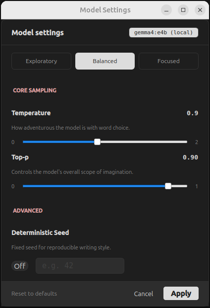

# 🎚️ LLM Settings & Presets

SammyAI allows you to fine-tune the "personality" and behavior of your AI writing partner. In Alpha 0.3.1, the settings panel has been redesigned to include easier control through curated presets and the addition of a reproducibility parameter.

---

## 1. Creative Presets

If you aren't sure which manual settings to use, our presets provide instant configurations optimized for different stages of the creative process:

*   **Exploratory**: Sets high Temperature and Top-P. Best for brainstorming, world-building, and finding unexpected story directions.
*   **Balanced**: The "sweet spot" for standard narrative writing. It offers a blend of creative flair and logical consistency.
*   **Focused**: Lowers randomness significantly. Ideal for fact-checking, strictly following complex instructions, or maintaining a rigid style.

## 2. Core Parameters

For those who want granular control, you can manually adjust the three primary sampling parameters:

### Temperature
Controls the "randomness" or "creativity" of word choice.
*   **Low**: Focused, deterministic, and conservative.
*   **High**: Diverse, innovative, and creative.

### Top-P (Nucleus Sampling)
Limits the AI to a "nucleus" of the most likely next words.
*   **Effect**: Reducing Top-P helps prune away nonsensical or highly irrelevant word choices, ensuring coherence without sacrificing style.

### Seed (New in Alpha 0.3.1)
The `seed` parameter allows for **reproducible results**. 
*   **How it Works**: By setting a specific seed number, you can generate the exact same response multiple times (provided other settings remain unchanged).
*   **When to Use**: Perfect for iterative editing where you want to see how small changes in your prompt affect the output while keeping the model's "randomness" fixed.

## 3. Applying Changes
You can access these controls via the **Settings (gear)** icon in the sidebar.

1.  **Toggle Presets**: Click a preset button to automatically move the sliders to recommended positions.
2.  **Manual Tweak**: Adjust the sliders for Temperature and Top-P, or enter a specific Seed value.
3.  **Apply**: Changes take effect immediately for all subsequent AI interactions.

---

> [!TIP]
> **Combine Presets with CIN.**
> When using **Context Injection** for a story bible, try the **Focused** preset to ensure the AI strictly adheres to the facts you've provided. Switch back to **Exploratory** when you're ready for the AI to suggest new plot twists.
