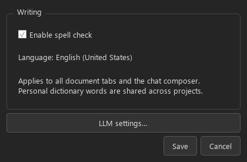

# US English spell check

Open **Settings** using the sidebar gear or **Edit > Settings**. Under **Writing**,
check or uncheck **Enable spell check**, then choose **Save**. Cancel leaves the
preference unchanged. The language is **English (United States)**; the setting
applies to every document tab and the chat composer and survives restarting.
Spell checking is enabled by default. Writers using other English variants or
languages can turn it off.

Misspellings get light pink wavy underlines after a short typing pause. Right-click an
underlined word and open **Spelling — English (United States)** for up to five
ranked suggestions. Select one to replace only that occurrence. Corrections
support Undo and Redo; text is never corrected automatically. Standard editing
commands remain available in the menu.

- **Ignore Once** suppresses this occurrence while it remains unchanged in the
  open widget, including after inserting text before it.
- **Ignore All** suppresses that word in all tabs and the composer for this app
  session. Restarting restores the checks.
- **Add to Dictionary** saves the word locally across restarts and projects.
  It is useful for character names, invented places, and specialist terms.

Spelling runs offline and sends no text to an LLM or external service. Checking
and suggestions run in background workers. Search highlights and spelling
underlines coexist. URLs, email addresses, common paths, Markdown backtick spans,
fenced code blocks, numbers, and configured screenplay abbreviations are ignored.
Hyphenated compounds are checked as separate words; smart apostrophes are accepted.

Personal words and the toggle are stored in `writing_preferences.json` in the
SammyAI configuration directory (normally `%APPDATA%/SammyAI` on Windows, or
`SAMMYAI_CONFIG_DIR` when overridden). Personal words are global in this release;
project-specific dictionaries and a dictionary management screen are future work.
To remove an added word, close SammyAI and remove it from `personal_words` in that
file. `screenplay_tokens` can optionally override the uppercase abbreviation list.
The defaults are INT, EXT, CONT, CONTINUED, VO, OS, POV, and SFX.

The Settings dialog also opens the existing **LLM settings** controls. Model
presets and sampling parameters keep their existing behavior.
