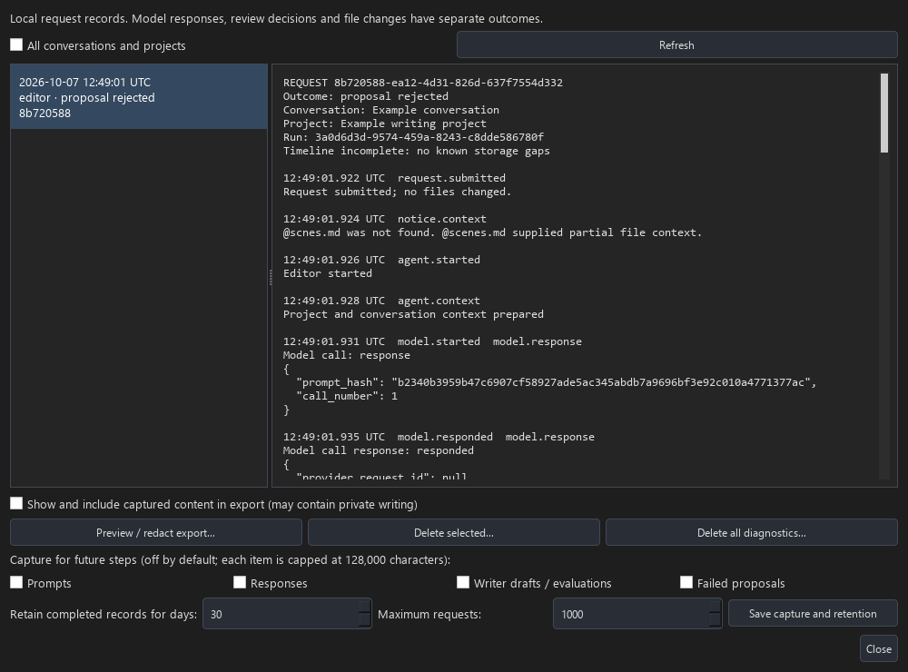

# Chat and Agent Diagnostics

Open **Advanced > Chat and Agent Diagnostics…**. Select a request to inspect its
timeline. The list initially shows the active conversation; **All conversations
and projects** also finds records from other or deleted conversations. Use
**Refresh** to load progress while a request is running.

## Investigate a failure

1. Check the request's outcome and whether the timeline is marked incomplete.
2. Inspect **context.prepared** for misspelled or missing references, source
   hashes, supplied character ranges, token budgets, partial files and selected
   retrieval or memory sources. Retrieval failure, an empty search and an
   unavailable retrieval service have different statuses. Indexing failures are
   counted in the context synchronization report.
3. Follow each **model** step. Writer has separate draft, evaluation and revision
   calls. A successful response does not mean its proposal was valid or applied.
   Empty and provider-reported truncated stages prevent a file proposal from
   proceeding. Missing provider IDs, usage and finish reasons remain unknown.
4. Inspect **proposal** errors and notices. Text-block, JSON and envelope failures are
   identified separately. JSON errors identify the line and column
   inside the directive body; `json_error` in the technical event also records
   the character position without retaining the proposal text. Ask the agent to
   regenerate a rejected proposal with valid JSON. With failed-proposal capture
   enabled, the original response is available under captured evidence.
5. Follow **review** and **files** events to see hunk decisions, accepted change
   set IDs, conflicts, application, rollback and subsequent undo/redo. Only
   **files.applied** (or **files.redone**) confirms a completed file write.

Warnings and failures also reappear below the saved chat transcript. They are
read from diagnostic records, separately from chat messages, and are not fed
back into model prompts. Old conversations have no retroactive request traces.
The **Request** prefix identifies the original request, not a new failure.
Proposal rejections appear once in restored chat; their technical exceptions
remain available in the diagnostics timeline.

New requests use [plain-text file proposals and targeted replacements](10_Agent_File_Editing.md).
The validation event identifies `text-v2` versus legacy `json-v1` and the proposed
operations. Text-block errors identify missing or conflicting markers without
including the failed writing in metadata.

In legacy JSON proposals, one narrowly defined formatting error can be recovered: a missing closing `}`
on the final file object when its strings, array/root closers and envelope are
otherwise complete. SammyAI inserts only that brace, preserves every supplied
value, and performs the normal file and context checks. **File proposal formatting
corrected** means the resulting diff still needs approval. Read-only agents and
empty or provider-reported truncated workflows cannot use this recovery.

The timeline records `proposal.syntax_error` and `proposal.syntax_recovered`,
including the insertion location and before/after hashes. Failed-proposal capture
retains the original malformed response when enabled, even if recovery succeeds.
Other damage, such as broken quotes, extra text or missing content, is rejected.
There are no extra model calls or automatic file writes.

## Content capture

Structural metadata is always recorded locally. The four independent capture
settings start **off**:

| Setting | Evidence retained when enabled |
| --- | --- |
| Prompts | User submission and each call's composed system prompt and messages |
| Responses | Single-call responses and final Writer revisions |
| Writer drafts / evaluations | First draft and evaluator output |
| Failed proposals | Original responses rejected during proposal processing |

Click **Save capture and retention** to change future capture steps. Each item
is capped at 128,000 characters. The record explicitly shows disabled capture
and truncation. A request may have both captured and uncaptured items if settings
changed during the run. Capture cannot recover past uncaptured text. These are
observable inputs and outputs; private model reasoning is never requested.

Credentials are excluded from configuration records. Known configured API keys,
credential fields, common key formats, bearer tokens and credential-bearing
URLs are redacted before persistence. Content can still contain private writing,
names and paths, so inspect exports before sharing. Diagnostic content is stored
in SQLite, separately from routine rotating application logs; it is not encrypted
by SammyAI. Normal conversation persistence remains separate from these settings.

## Export and offline inspection

**Preview / redact export…** opens an editable JSON preview for the selected
request. Captured content is excluded by default. Select **Show and include
captured content in export** only when needed. Metadata itself can include
filenames, paths and exception explanations. Remove private values in the
preview, preserve valid JSON, then save. Nothing is uploaded or sent to a model.
Cancel leaves no export file. Exported copies are not managed by retention.

Developers can pass captured proposal text to
`sammyai_core.diagnostics.inspect_proposal(text)` for offline envelope/JSON
inspection. This function has no provider or file tools and cannot apply edits.
Its `parsed` result is not authorization or proof that a proposal passes source,
path or addition-policy validation. Those validations can be exercised through
the agent workflow's deterministic fixtures against a temporary test project.
This inspector is strict: it reports the original syntax error even when the
workflow can recover a single missing file-object brace.

## Retention and deletion

The defaults are 30 days and 1,000 requests. Retention runs on startup, submission
and settings changes. Running requests and pending reviews are kept until they
finish or become interrupted; the limit may temporarily be exceeded. The viewer
shows up to 10,000 records. Use **Delete selected…** or **Delete all
diagnostics…** to remove records, steps, links and captured content. Deleting
diagnostics does not delete conversations or alter project files. Deleting a
conversation or removing a project does not automatically remove its diagnostics;
use the all-conversations view or retention controls for that data.

SQLite secure deletion and a WAL checkpoint are used for explicit deletion.
Backups, existing export files and filesystem snapshots remain outside these
controls. The database is `sammyai.sqlite3` in SammyAI's application data directory
(on Windows, normally `%LOCALAPPDATA%/SammyAI/data/`).

## Restart and storage failures

On restart, unfinished calls and pending reviews are marked **interrupted**.
No writes or reviews are replayed. An interruption during file application can
leave its final outcome unknown: inspect the files instead of assuming success.
Completed records and previous undo/redo events remain readable; the editable
review and file-tool undo stack themselves are not restored.

If diagnostics cannot be written, SammyAI shows a storage warning and marks
subsequent records in that app session incomplete. The original request failure
and existing file protections remain in effect. Records that could not be saved
cannot be reconstructed. Restore storage access before reproducing the issue.
