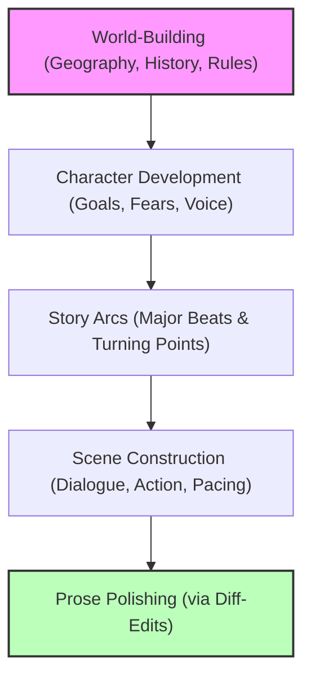

# 🪜 Step-by-Step Development

Unpredictability is the enemy of a great story. When you ask an AI to "write a whole chapter" without preparation, you often get generic plots and inconsistent characters. The most successful SammyAI users treat their project as a construction site, building the narrative layer by layer.

---

## 👑 You are the Project Leader

In the creative partnership with SammyAI, **you hold the keys**. SammyAI is an expert executor, but it lacks your internal compass. By leading the journey and providing clear goals for each step, you ensure the AI remains a complement to your vision, not a replacement for it.

> [!IMPORTANT]
> **Lead the Journey**
> SammyAI thrives on direction. Instead of asking it what should happen next, tell it where you want to go and ask it for the best way to get there.

---

## 🏗️ The Building Blocks of a Story

Systematic development prevents "creative drift" and ensures every element of your story is interconnected and coherent.

### 1. Build the Foundations (World & Rules)
Start by defining the "where" and "why." Use **Context Injection (CIN)** to feed SammyAI your world-building notes so it understands the constraints of your setting.

### 2. Flesh Out the Inhabitants (Characters)
Develop your characters' internal lives before they ever speak a word of dialogue. Establish their distinct voices so the AI can mimic them accurately later.

### 3. Map the Path (Story Arcs)
Break your narrative into manageable chunks. Working through a story systematicially allows you to catch plot holes early and adjust the trajectory before you've written thousands of words.

---

## 📅 Staying Organized

As your project grows, staying organized is crucial for maintaining narrative quality.

| Developmental Stage | Recommended Tool | Why? |
| :--- | :--- | :--- |
| **Brainstorming** | Multi-Modal Chat | Fast experimentation with multiple models. |
| **Lore Management** | RAG | Efficiently reference deep history or massive series data. |
| **Scene Editing** | Diff-Edits (DBE) | Surgical precision for dialogue and prose. |

> [!TIP]
> **Gradual Integration**
> As you complete a character sheet or world guide, add it to your **CIN** or **RAG** index immediately. This ensures SammyAI's "memory" grows alongside your project.

---

## 🛑 Avoid the "Magic Bullet" Fallacy

Large-scale, single-prompt requests (e.g., *"Write the ending of my book"*) are prone to "unpredictability." The AI may introduce characters that don't exist or ignore established plot points. 

**Building gradually isn't just about control—it's about quality.** Each step you take with SammyAI reinforces the previous one, creating a narrative that feels intentional, human, and uniquely yours.
