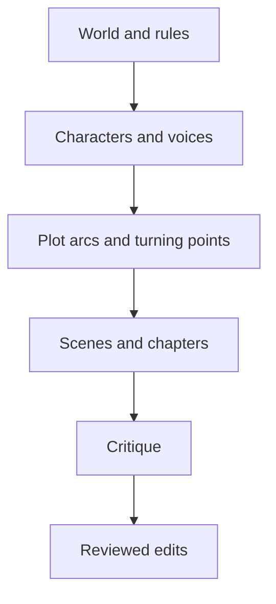

# Step-by-Step Development

Large stories become stronger when they are built in layers. SammyAI can help with each layer, but the best results come from clear sequencing and review.

---

## You Are the Project Lead

SammyAI can propose, draft, and revise, but it does not know your private taste or long-term intent unless you provide it.

> [!IMPORTANT]
> Lead the work. Tell SammyAI what you want to achieve, what must stay fixed, and what can change.

---

## A Practical Story Workflow

```mermaid
graph TD
    A["World and rules"] --> B["Characters and voices"]
    B --> C["Plot arcs and turning points"]
    C --> D["Scenes and chapters"]
    D --> E["Critique"]
    E --> F["Reviewed edits"]
```

### 1. Build the Foundation

Create world rules, character notes, and story constraints. Store stable facts in project memory once they are approved.

### 2. Develop Characters

Define goals, fears, speech patterns, contradictions, and relationships before drafting important scenes.

### 3. Map the Arc

Break the story into beats, chapters, episodes, or scenes. Ask the Brainstormer for alternatives before committing.

### 4. Draft in Pieces

Use the Writer agent for focused segments. Keep each request narrow enough for review.

### 5. Critique Before Editing

Use the Critic agent to identify weak motivation, inconsistent tone, pacing problems, or missing context.

### 6. Apply Reviewed Edits

Use the Editor agent when you want project files changed. Review the change set before applying it.

---

## Staying Organized

| Stage | Recommended Tool | Why |
| :--- | :--- | :--- |
| Brainstorming | Brainstormer | Explore options quickly |
| Drafting | Writer | Produce focused prose |
| Lore management | Project Context and Memory | Preserve continuity |
| Critique | Critic | Find issues without edits |
| Revision | Editor and change sets | Review changes safely |

> [!TIP]
> When a character sheet or world rule becomes stable, save the key facts as persistent memory and keep the source file in the project.
