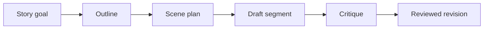

# Handling Large Tasks

Large tasks work best when broken into focused steps. Asking for a complete long chapter or full story in one prompt usually gives you less control and weaker continuity.

---

## The Modularity Principle

Build one useful piece at a time.

---

## Why Massive Requests Drift

Long generations can move away from your original intent. The model may repeat patterns from its own output, introduce unnecessary details, or ignore constraints that were only stated once.

---

## Modular Workflow

1. **Plan:** Ask the Brainstormer for options and choose a direction.
2. **Outline:** Create beats, constraints, and character goals.
3. **Draft:** Use the Writer agent for one scene or section.
4. **Critique:** Ask the Critic to identify issues.
5. **Revise:** Ask the Editor for a reviewed change set when project files should change.
6. **Save decisions:** Store important approved facts in persistent memory.

---

## Use Context Carefully

* Use explicit file references for files that must be followed.
* Use attached references for short bridging summaries.
* Use project context for larger source material.
* Use memory for durable decisions and facts.

> [!TIP]
> Before moving from one major segment to another, summarize the completed segment and save only the facts that should remain important.
